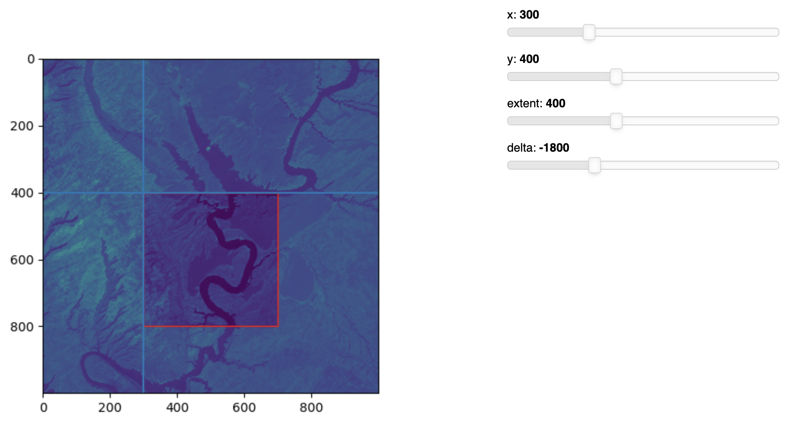

# pixel-adjust
Interactively select and adjust specific pixels or regions within a single-band raster. Built with rasterio, matplotlib, and panel. This fork: doesn't use conda, uses pip, and adds dockerfile (which does use conda since rasterio!)

<p align="center">

</p>

## Docker
```
docker build -t pixel-adjust .

docker run -p 5006:5006 pixel-adjust
```

## Dev using pip
* `python3 -m venv venv`
* `source venv/bin/activate`
* `(venv) pip install -r requirements.txt`
* `(venv) jupyter labextension install @pyviz/jupyterlab_pyviz`
* `(venv) panel serve --show bands.ipynb` # run from notebook
* `(venv) panel serve bands.py` # run from .py